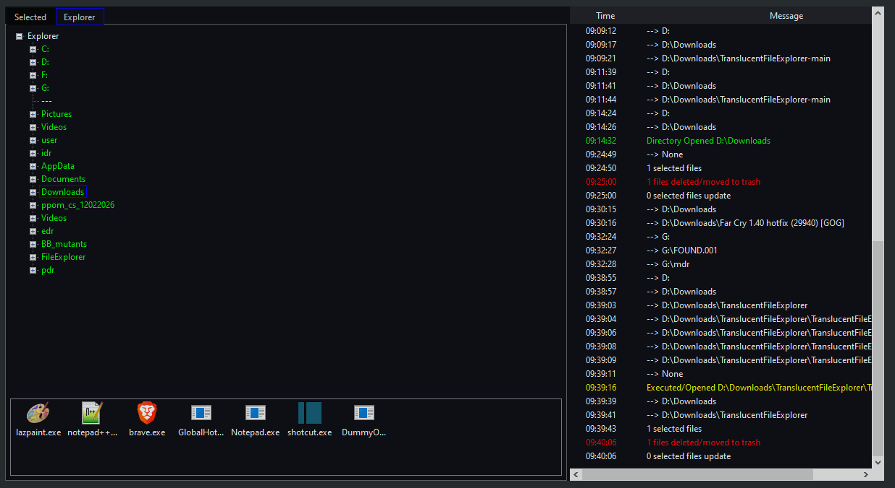

# TranslucentFileExplorer



It's under development, so it's not a full featured file explorer yet.

## Installation
Minimalist Translucent File Explorer based on Tree View (windows 10, 11).

1. Download .NET 10 at https://dotnet.microsoft.com/download
2. Install .NET SDK
3. Download this repository
4. Create a folder to put TranslucentFileExplorer
5. Extract the contents of this repository inside that folder
6. Run the batch script release.bat to compile 
7. go to binary folder and open the program 

To use a different version of .NET you will need to modify the csproj file on TargetFramework tag to the desired .NET version.

```html
<Project Sdk="Microsoft.NET.Sdk">

  <PropertyGroup>
    <OutputType>WinExe</OutputType>
    <TargetFramework>net10.0-windows</TargetFramework>
    <Nullable>enable</Nullable>
    <UseWindowsForms>true</UseWindowsForms>
    <ImplicitUsings>enable</ImplicitUsings>

	<ApplicationIcon>FileExplorer.ico</ApplicationIcon>	
	
  </PropertyGroup>
  
<ItemGroup> 
	<EmbeddedResource Include="FileExplorer.ico" /> 
</ItemGroup>  
</Project>
```
## Usage 

If everything goes right you can expand the Explorer tree on Explorer tab. The interface have options on context menu (right-click).
1. To delete files you need to select the files first, with enter or on Select Files context menu option. Then go to Select tab and use context menu to delete the files.
2. You can add folders to the tree using context menu, these folders will be displayed on interface next time you open the explorer.
3. Double-click on tab bar to hide the titlebar.
4. You can dock the fileexplorer on top of the window using the Docking Toggle option.

